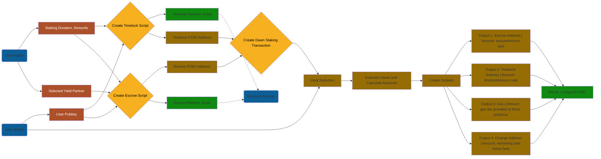
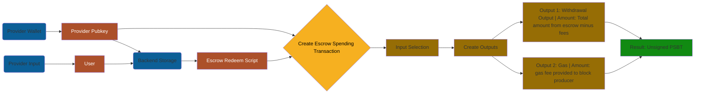

# User Stories of Staking Flow

The full v0 user stories for the staking flow. This is pre-server, so we assume discoverability and tracking via tx metadata (To be implemented)

## User Deposits Stake

Uses DawnStakingManager's createDawnStakingTransaction to create a new staking transaction, which sends outputs to the Escrow and Timelock addresses.

Parameters:

```ts
export interface DawnStakingParams {
  /** Array of unspent transaction outputs to stake (optional - will auto-select from address if not provided) */
  inputs?: UTXO[];
  /** Source address for automatic UTXO selection (required if inputs not provided) */
  sourceAddress: string;
  /** Escrow script address */
  escrowAddress: string;
  /** Amount to send to escrow in satoshis */
  escrowAmount: number;
  /** Timelock script address */
  timelockAddress: string;
  /** Amount to send to timelock in satoshis */
  timelockAmount: number;
  /** Optional change address for remaining funds */
  changeAddress?: string;
  /** Optional fee rate in satoshis per byte */
  feeRate?: number;
  /** Optional fee address for protocol fees */
  feeAddress?: string;
  /** Optional protocol fee amount in satoshis (required if feeAddress is provided) */
  protocolFeeAmount?: number;
}
```



## Yield Provider Withdraws Stake

Uses EscrowManager's createEscrowSpendingTransaction to create a transaction that spends from the escrow output

```ts
export interface EscrowSpendingParams {
  /** Script data returned from createEscrowScript */
  scriptData: ScriptInfo;
  /** Transaction ID of the UTXO to spend */
  utxoTxId: string;
  /** Output index of the UTXO to spend */
  utxoIndex: number;
  /** Amount in satoshis to spend */
  amount: number;
  /** Address to send funds to */
  outputAddress: string;
  /** Whether to spend after deadline (true) or before (false) */
  spendAfterDeadline: boolean;
  /** Current time for validation (defaults to Date.now()) */
  currentTime?: number;
  /** Previous transaction buffer (for testing/validation) */
  previousTransaction?: Buffer | null;
}
```



## Yield Provider Distributes Rewards

Uses the YieldDistributor's distributeYield to create a transaction that sends rewards from the yield provider to the user's timelock address.

```ts
export interface YieldDistributionParams {
  /** Array of unspent transaction outputs from timelock (optional - will fetch from address if not provided) */
  inputs?: YieldInput[];
  /** Source address for automatic UTXO selection (required if inputs not provided) */
  sourceAddress?: string;
  /** Bitcoin API instance for fetching UTXOs (required if inputs not provided) */
  api?: BitcoinAPI;
  /** Address of the timelock script */
  timelockAddress: string;
  /** Amount to distribute in satoshis */
  amount: number;
  /** Optional memo for the distribution */
  memo?: string;
  /** Optional change address for remaining funds */
  changeAddress?: string;
  /** Optional fee rate in satoshis per byte */
  feeRate?: number;
}
```

```mermaid

```

## User Withdraws Stake and Rewards

Uses the DawnStakingManager's createDawnWithdrawalTransaction to create a transaction that spends from the timelock output, which includes both the original stake and any accumulated rewards, as well as anything left over at the escrow address.

```ts
export interface DawnWithdrawalParams {
  /** Array of escrow inputs to withdraw from (optional - will fetch all UTXOs from escrow address if not provided) */
  escrowInputs?: UTXO[];
  /** Escrow script address (optional - will be calculated from escrowRedeemScript if not provided) */
  escrowAddress?: string;
  /** Escrow redeem script in hexadecimal format */
  escrowRedeemScript: string;
  /** Array of timelock inputs to withdraw from (optional - will fetch all UTXOs from timelock address if not provided) */
  timelockInputs?: UTXO[];
  /** Timelock script address (optional - will be calculated from timelockRedeemScript if not provided) */
  timelockAddress?: string;
  /** Timelock redeem script in hexadecimal format */
  timelockRedeemScript: string;
  /** Destination address for withdrawn funds */
  destination: string;
  /** Optional fixed fee amount in satoshis */
  feeAmount?: number;
  /** Optional fee address for protocol fees */
  feeAddress?: string;
  /** Optional protocol fee amount in satoshis (required if feeAddress is provided) */
  protocolFeeAmount?: number;
}
```

```mermaid

```
