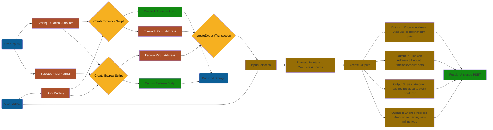
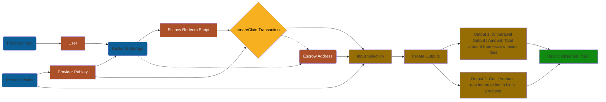
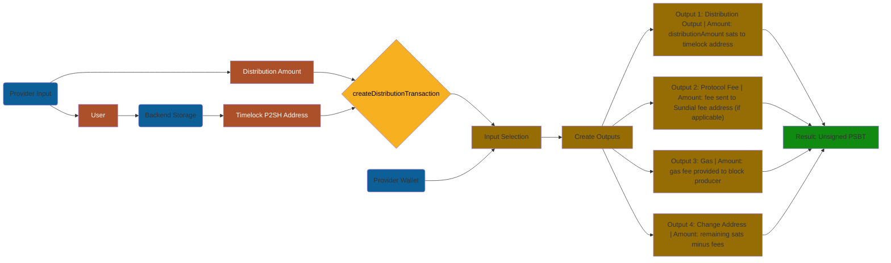
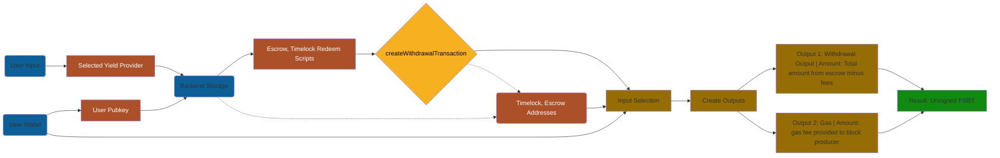

# User Stories of Staking Flow

The full v0 user stories for the staking flow.

## User Deposits Stake

Uses createDepositTransaction to create a new Deposit transaction, which sends outputs to the Escrow and Timelock addresses.

Parameters:

```ts
export interface DepositParams {
  /** Array of unspent transaction outputs to deposit (optional - will auto-select from address if not provided) */
  inputs?: UTXO[];
  /** Source address for automatic UTXO selection (required if inputs not provided) */
  sourceAddress: string;
  /** Escrow script address */
  escrowAddress: string;
  /** Amount to send to escrow in satoshis */
  escrowAmount: number;
  /** Timelock script address */
  timelockAddress: string;
  /** Amount to send to timelock in satoshis */
  timelockAmount: number;
  /** Optional change address for remaining funds */
  changeAddress?: string;
  /** Optional fee address for protocol fees */
  feeAddress?: string;
  /** Optional protocol fee amount in satoshis (required if feeAddress is provided) */
  protocolFeeAmount?: number;
}
```



## Yield Provider Withdraws Stake

Uses createClaimTransaction to create a transaction that spends from the escrow output

```ts
export interface ClaimParams {
  /** Script data returned from createEscrowScript */
  scriptData: ScriptInfo;
  /** Transaction ID of the UTXO to spend */
  utxoTxId: string;
  /** Output index of the UTXO to spend */
  utxoIndex: number;
  /** Amount in satoshis to spend */
  amount: number;
  /** Address to send funds to */
  outputAddress: string;
  /** Whether to spend after deadline (true) or before (false) */
  spendAfterDeadline: boolean;
  /** Current time for validation (defaults to Date.now()) */
  currentTime?: number;
  /** Previous transaction buffer (for testing/validation) */
  previousTransaction?: Buffer | null;
}
```



## Yield Provider Distributes Rewards

Uses createDistributionTransaction to create a transaction that sends rewards from the yield provider to the user's timelock address.

```ts
export interface DistributionParams {
  /** Array of unspent transaction outputs from timelock (optional - will fetch from address if not provided) */
  inputs?: UTXO[];
  /** Source address for automatic UTXO selection (required if inputs not provided) */
  sourceAddress?: string;
  /** Bitcoin API instance for fetching UTXOs (required if inputs not provided) */
  api?: BitcoinAPI;
  /** Address of the timelock script */
  timelockAddress: string;
  /** Amount to distribute in satoshis */
  amount: number;
  /** Optional change address for remaining funds */
  changeAddress?: string;
}
```



## User Withdraws Stake and Rewards

Uses createWithdrawalTransaction to create a transaction that spends from the timelock output, which includes both the original deposit and any accumulated rewards, as well as anything left over at the escrow address.

```ts
export interface WithdrawalParams {
  /** Array of escrow inputs to withdraw from (optional - will fetch all UTXOs from escrow address if not provided) */
  escrowInputs?: UTXO[];
  /** Escrow script address (optional - will be calculated from escrowRedeemScript if not provided) */
  escrowAddress?: string;
  /** Escrow redeem script in hexadecimal format */
  escrowRedeemScript: string;
  /** Array of timelock inputs to withdraw from (optional - will fetch all UTXOs from timelock address if not provided) */
  timelockInputs?: UTXO[];
  /** Timelock script address (optional - will be calculated from timelockRedeemScript if not provided) */
  timelockAddress?: string;
  /** Timelock redeem script in hexadecimal format */
  timelockRedeemScript: string;
  /** Destination address for withdrawn funds */
  destination: string;
  /** Optional fee address for protocol fees */
  feeAddress?: string;
  /** Optional protocol fee amount in satoshis (required if feeAddress is provided) */
  protocolFeeAmount?: number;
  /** Optional change address for remaining funds */
  changeAddress?: string;
}
```



---

# Transaction Preconditions

What must be true before each transaction step is valid, and what enforces each precondition.

| Step                         | Precondition                                                                                                                              | Enforced by                                                                     |
| ---------------------------- | ----------------------------------------------------------------------------------------------------------------------------------------- | ------------------------------------------------------------------------------- |
| **Deposit**                  | User has confirmed UTXOs covering escrow amount + timelock amount + fees                                                                  | Bitcoin mempool (unconfirmed inputs rejected by nodes)                          |
| **Deposit**                  | Both script addresses are correctly derived from the agreed redeem scripts                                                                | Convention — address derivation is deterministic but inputs are caller-supplied |
| **Claim**                    | Escrow UTXO is confirmed on-chain                                                                                                         | Bitcoin (unconfirmed outputs cannot be spent)                                   |
| **Claim**                    | Transaction is signed by `beforePublicKey` (provider)                                                                                     | Bitcoin `OP_CHECKSIG`                                                           |
| **Claim**                    | Deadline has **not** passed _(convention only — see [trust model](./trust-model.md#known-trust-assumption-provider-race-after-deadline))_ | Off-chain agreement only                                                        |
| **Distribute**               | Provider has sufficient confirmed funds in their own wallet                                                                               | Bitcoin mempool                                                                 |
| **Distribute**               | Output is sent to the user's timelock address                                                                                             | Off-chain agreement only; library accepts any address                           |
| **Withdraw (escrow path)**   | `nLockTime` of the spending transaction is ≥ `deadline`                                                                                   | Bitcoin `OP_CHECKLOCKTIMEVERIFY`                                                |
| **Withdraw (escrow path)**   | Transaction is signed by `afterPublicKey` (user)                                                                                          | Bitcoin `OP_CHECKSIG`                                                           |
| **Withdraw (timelock path)** | `nLockTime` of the spending transaction is ≥ `locktime`                                                                                   | Bitcoin `OP_CHECKLOCKTIMEVERIFY`                                                |
| **Withdraw (timelock path)** | Transaction is signed by `publicKey` (user)                                                                                               | Bitcoin `OP_CHECKSIG`                                                           |

## Normal vs. Emergency Paths

`createWithdrawalTransaction` is the **normal user withdrawal** — it spends both scripts simultaneously after the shared deadline.

`createClaimTransaction` with `spendAfterDeadline: true` is the **emergency user reclaim path** — it spends only the escrow `OP_IF` branch. This is used when the user needs to reclaim from the escrow independently (e.g. if the timelock has already been swept, or the user prefers to spend them separately). It is not a provider operation.
